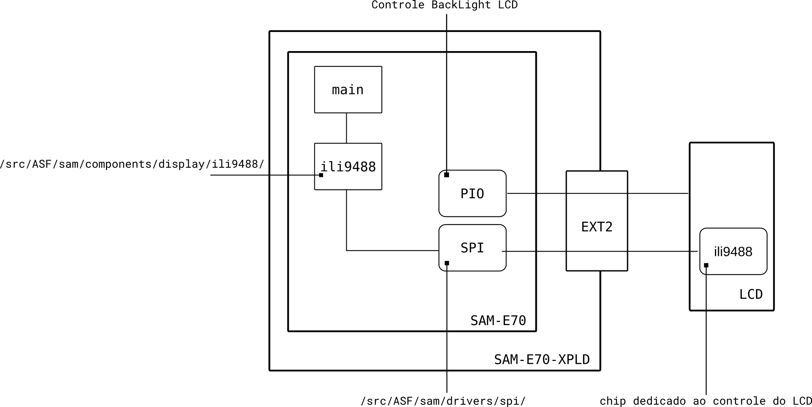
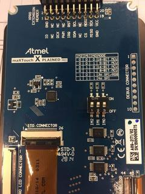
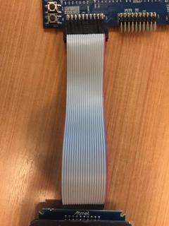
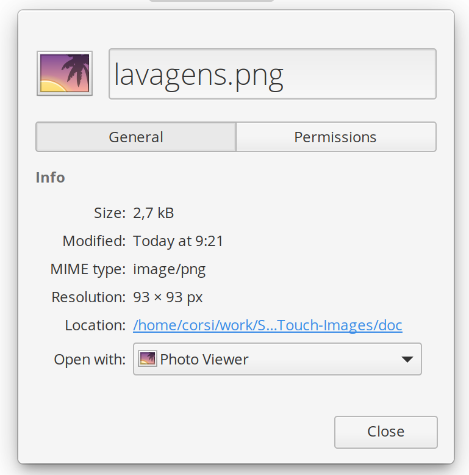
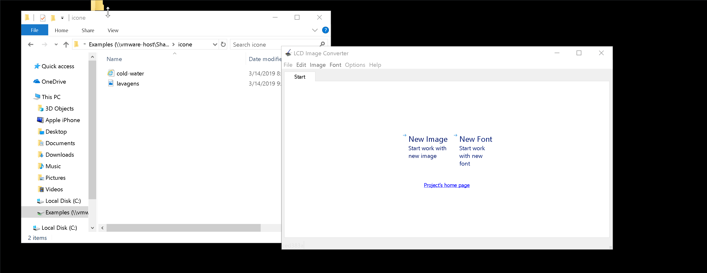
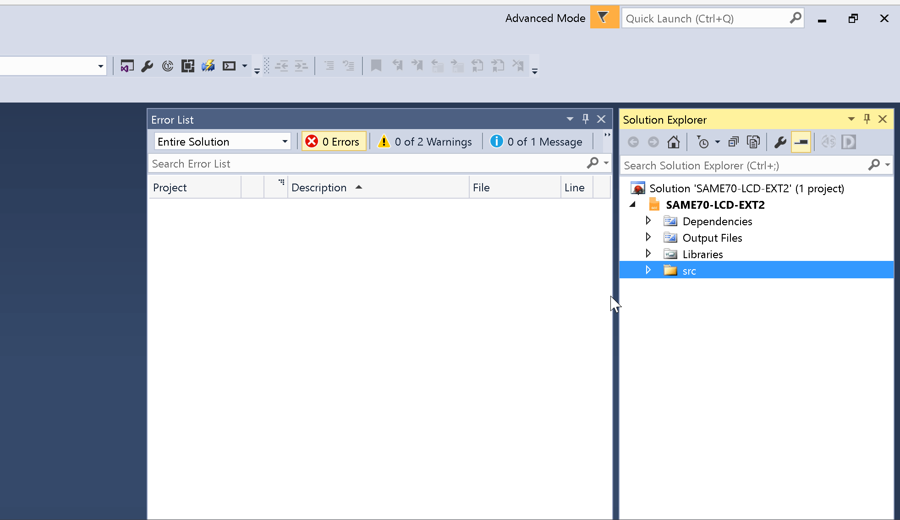

- Computação Embarcada - Insper
- Rafael Corsi 

Esse exemplo demonstra o controle do módulo de LCD maX Touch X PLAINED PRO via interface SPI (Serial Peripheral Interface Bus).

Periféricos uC:

  - Power Managment Controller (PMC)
  - USART
  - Serial Protocol Interface (SPI)

APIs :

  - Driver ili9488

Módulos : 

  - LCD maX Touch X PLAINED PRO 

## Diagrama



## Conexão e configuração

Deve-se configurar o módulo do LCD para operar via SPI via o dip switch localizado na parte de traz do módulo, como na imagem a baixo :

{width=50%}

Para conectar o LCD no EXT2, deve-se seguir a referência de polaridade do flat cable a baixo :

{width=50%}

## USART

- BaudRate : 115200
- StopBit  : 1 bit
- Paridade : 0 bit
- Data     : 8 bits

Utilizado como debug do programa, deve-se utilizar um terminal (exe. putty) no computador para acessar o printf realizado no firmware.

## SPI

- BaudRate : 20000000
- 8 bits

O Serial Peripheral Interface Bus (SPI) é uma maneira serial de dois dispositivos (ou chips) se comunicarem, o SPI é amplamente
utilizado pela industria e diversos sensores e atuadores o utilizam com forma de comunicação. 


O SPI possui as seguintes configurações :

 - Síncrono 
 - Barramento diferenciado de dados de entrada/saída
 - Serial

Para mais informações acesse o site da sparkfun : [SPI SparkFun](https://learn.sparkfun.com/tutorials/serial-peripheral-interface-spi)

O SPI é utilizado pela API ili9488 para acessar e configurar o LCD.

## LCD

- Colorido
    - RGB, 8 bits por cor
- Resolução de : 320x480

### ili9488 (controlador LCD)

O ili9488 é um CI dedicado ao controle do LCD integrado no módulo LCD maX Touch X PLAINED PRO, a comunicação do microcontrolador com o
LCD é via a interface com o [ili9488](https://www.lpcware.com/system/files/ILI9488_Preliminary_DS_V090.pdf).
Esse dispositivo é responsável por :

- Acionar independente cada pixel (RGB) e fazer o acionamento (analógico)
- fazer o refresh no LCD (atualizar os pixels a uma taxa fixa)
- Receber novos valores para os pixels
- ...

Os comandos de comunicação com o ili9488 são definidos na biblioteca /src/ASF/sam/components/display/ili9488/. Essa biblioteca possui
também alguns comandos gráficos simples tais como :

```C
uint32_t ili9488_draw_pixel(uint32_t ul_x, uint32_t ul_y);

void ili9488_draw_line(uint32_t ul_x1, uint32_t ul_y1,
		uint32_t ul_x2, uint32_t ul_y2);
        
void ili9488_draw_rectangle(uint32_t ul_x1, uint32_t ul_y1,
		uint32_t ul_x2, uint32_t ul_y2);
        
void ili9488_draw_filled_rectangle(uint32_t ul_x1, uint32_t ul_y1,
		uint32_t ul_x2, uint32_t ul_y2);
        
uint32_t ili9488_draw_circle(uint32_t ul_x, uint32_t ul_y, uint32_t ul_r);

uint32_t ili9488_draw_filled_circle(uint32_t ul_x, uint32_t ul_y, uint32_t ul_r);
```

### RGB

 O ili9488 está configurado nesse exemplo para operar em modo RGB, as cores são definidas do tipo **ili9488\_color\_t** e possuem formato RGB, sendo 8 bits para definir a intensidade de cada cor, como nos exemplos a seguir :

```C
#define COLOR_BLUE           (0x0000FFu)
#define COLOR_GREEN          (0x00FF00u)
#define COLOR_RED            (0xFF0000u)
#define COLOR_NAVY           (0x000080u)
#define COLOR_DARKCYAN       (0x008B8Bu)
#define COLOR_TURQUOISE      (0x40E0D0u) 
```

Porém esse formato deve ser convertido para a transmissão, via a macro : **COLOR\_CONVERT**. Exemplo :

```C
ili9488_set_foreground_color(COLOR_CONVERT(COLOR_WHITE));
```

# Usando uma imagem no LCD 

Para conseguirmos atualizar o LCD com uma imagem pré definida será necessário convertermos essa imagem para o padrão de pixels
definido na secção anterior e depois alocarmos essa imagem em uma constante para que o microcontrolador possa enviar ao ili9488.

Passos :

1. Definir a imagem na dimensão correta (em pixels)
1. Converter a imagem para o formato do LCD / gerar um vetor de pxs
   - Gerar um arquivo .h para ser incluído no projeto
1.. Ler o arquivo .h e atualizar o LCD via a interface com ili9488

Para isso iremos utilizar o programa [`lcd-image-converter`](https://sourceforge.net/projects/lcd-image-converter/), fazer o download e instalar (windows)/

### 1 - Escolhendo imagem 

Vamos colocar o icone a seguir no LCD:


Salve o arquivo no PC: `lavagens.png`, repare que essa imagem possui dimissão de: `93`x`93`pxs.



### 2 Gerando `.h`



1. Abra o `lcd-image-converter` -> `File` -> `New image`
    - name: `lavagens`
1. `Image` -> `Import`
    - Abra o `lavagens.png`
1. `Options` -> `Conversion` -> `Import` -> `Color R8G8B8.xml` -> `Preset` = **R8G8B8** -> `Ok`
    - Arquivo de config. fornecido nesse tutorial
1. `File` -> `Convert...`
    - name: `lavagens.h`

Os passos anteriores convertem a imagem (`lavagens.png`) para um vetor de pixels (`lavagens.h`) utilizando a configuração `R8G8B8`. O arquivo `lavagens.h` possui:

#### tImage

Uma struct do tipo `tImage` comentada que será utilizada para salvar informações da imagem:

 -  `*data`: Ponteiro para a imagem (vetor)
 - `width`: Largura da imagem (em px)
 - `height`: Altura da imagem (em px)
 - `dataSize`: Tipo do dado do `*data`


`tImage` deve fazer parte do código porém só pode aparecer uma única definição! Sugestão: copiar descomentada para o cabeçalho `main.c` e deixar comentada nos arquivos `.h`.

 `lavagens.h`
```c
/*
 typedef struct {
     const uint8_t *data;
     uint16_t width;
     uint16_t height;
     uint8_t dataSize;
     } tImage;
*/
```

`main.c`
```diff
#include "asf.h"
#include <string.h>
#include <stdio.h>
#include <stdlib.h>
#include "ioport.h"

+typedef struct {
+    const uint8_t *data;
+    uint16_t width;
+    uint16_t height;
+    uint8_t dataSize;
+    } tImage;
```

#### Vetor de pxs

O arquivo `.h` gerado possui a declaração do vetor onde a imagem será salva.

```c
static const uint8_t image_data_lavagem[25947] = {
    0x9b, 0xcb, 0xfd, 0x22, 0x8c, ....
```

#### tImage lavagem

No final do arquivo possuimos a inicialização de uma struct `tImage` com os parâmetros dessa imagem. Isso será utilizado pelo
nosso código quando formos utilizar essa imagem.

```c
const tImage lavagem = { image_data_lavagem, 93, 93,  8 };
```

### Usando a imagem

1. Adicionar arquivo `lavagens.h` ao projeto
1. Incluindo arquivo no `main`
1. Usar funções do driver para desenhar no LCD

####  Adionando ao projeto

Agora é necessário adicionarmos o arquivo `lavagens.h` ao projeto. Com o exemplo do LCD aberto no Atmel Studio:



1. `Solution Explorer` -> `Botão Direito` em `src` -> `Add` -> `New Folder`
    - Nome: `icones`
1. Arrastar `lavagens.h` para dentro da pasta criada `icones`

#### Incluindo no main

Edite o `main.c` para incluir o arquivo `lavagens.h`, isso precisa ser feito após a definição do `tImage`:

```diff
typedef struct {
    const uint8_t *data;
    uint16_t width;
    uint16_t height;
    uint8_t dataSize;
    } tImage;
    
+#include "icones/lavagens.h"
```

#### Desenhando no LCD

Temos algumas opções para desenhar a imagem no LCD:

1. Atualizar o LCD pixel a pixel com os dados contidos no vetor
   - pouco eficiente, o LCD demorará para atualizar a imagem
   
2. Fazermos uma transferência direta de memória entre o uc e o ili9488 (burst)
   - mais eficiente e melhor método.

 Para implementarmos a transferência direta de memória é necessário configurarmos a região do LCD que será atualizado, para isso
 utilizaremos a função `ili9488\_draw\_pixmap` que possui implementa uma atualização parcial de uma região de memória do LCD. A implementação da funcão está na biblioteca do `ili9488` e copiado a baixo:

```C
 /**
 * \brief Draw a pixmap on LCD.
 *
 * \param ul_x X coordinate of upper-left corner on LCD.
 * \param ul_y Y coordinate of upper-left corner on LCD.
 * \param ul_width width of the picture.
 * \param ul_height height of the picture.
 * \param p_ul_pixmap pixmap of the image.
 */
void ili9488_draw_pixmap(uint32_t ul_x, uint32_t ul_y, uint32_t ul_width,
		uint32_t ul_height, const ili9488_color_t *p_ul_pixmap)
{
  uint32_t size;
  uint32_t dwX1, dwY1, dwX2, dwY2;
  dwX1 = ul_x;
  dwY1 = ul_y;
  dwX2 = ul_x + ul_width - 1;
  dwY2 = ul_y + ul_height - 1;

  /* Swap coordinates if necessary */
  ili9488_check_box_coordinates(&dwX1, &dwY1, &dwX2, &dwY2);

  /* Determine the refresh window area */
  ili9488_set_window(dwX1, dwY1, (dwX2 - dwX1 + 1), (dwY2 - dwY1 + 1));
  size = (dwX2 - dwX1) * (dwY2 - dwY1);

  ili9488_write_register(ILI9488_CMD_MEMORY_WRITE, p_ul_pixmap, size * LCD_DATA_COLOR_UNIT);

  /* Reset the refresh window area */
  ili9488_set_window(0, 0, ILI9488_LCD_WIDTH, ILI9488_LCD_HEIGHT);
}
```

Para usarmos essa função, basta a chamarmos com os parâmetros da imagem que desejamos desenhar. Insira no main logo antes do while(1):

 ```diff
  ili9488_set_foreground_color(COLOR_CONVERT(COLOR_BLACK));
  sprintf(stingLCD, "Computacao Embarcada %d", 2018);
  ili9488_draw_string(0, 50, stingLCD);

+ // desenha imagem lavagem na posicao X=80 e Y=150
+ ili9488_draw_pixmap(80, 150, lavagem.width, lavagem.height, lavagem.data);
 ```


